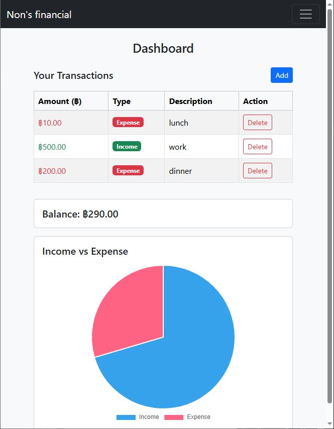
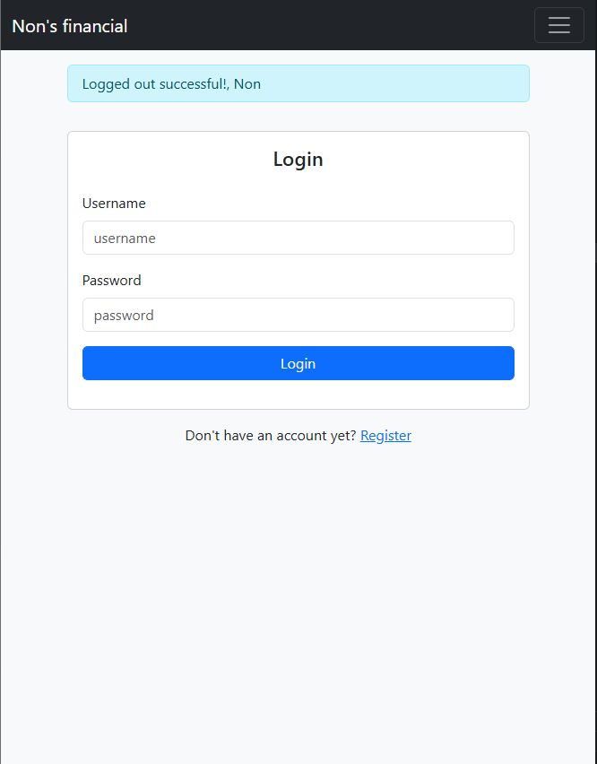
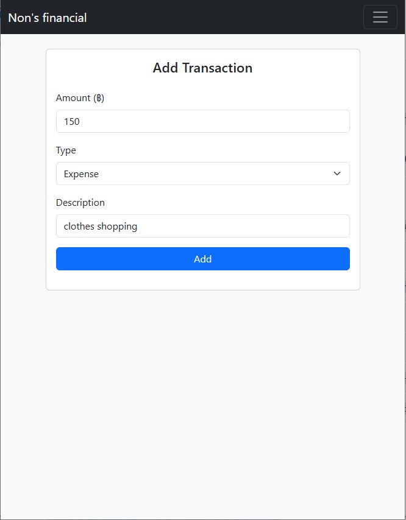

## Personal Finance Tracker

A simple full-stack web application that helps users track their income and expenses.
Users can add transactions, view their financial summary, and visualize spending using charts.

## Features

- User login system

- Add income and expense transactions

- Dashboard showing total income and expenses

- Pie chart visualization of financial data

- SQLite database for storing transactions and users account

- Clean web interface using HTML templates

## Tech Stack

- Backend

- Python

- Flask

## Frontend

- HTML

- Bootstrap

- Jinja2 Templates

- Chart.js

## Database

- SQLite

## How It Works

- Users log into their account.

- They can add transactions and choose whether it is income or expense.

- Transactions are stored in the SQLite database.

- The dashboard calculates totals using SQL queries.

- The results are displayed in a pie chart showing income vs expenses.

## What I Learned

While building this project, I learned several important full-stack development concepts:

- How to build a web application using Flask

- How to design and interact with a SQLite database

- Writing SQL queries to calculate totals and group data

- Using Jinja2 templates to send data from Python to HTML

- Creating pie chart using Chart.js

- Structuring a real-world project with routes, templates files

- Debugging backend and frontend integration issues

This project helped me understand how backend logic, databases, and frontend interfaces work together in a real application.

## Live Demo:
https://finance-tracker-g4ld.onrender.com

## Demo:

